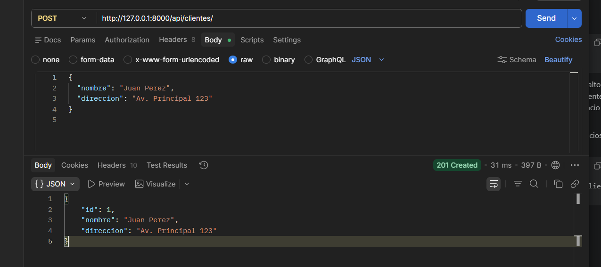
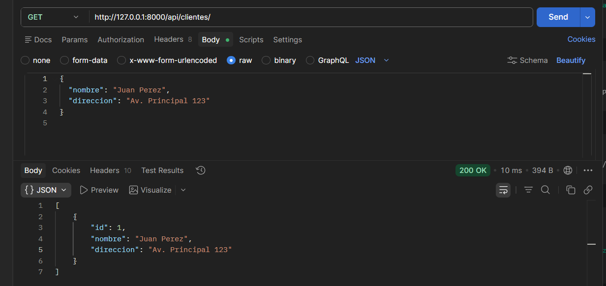
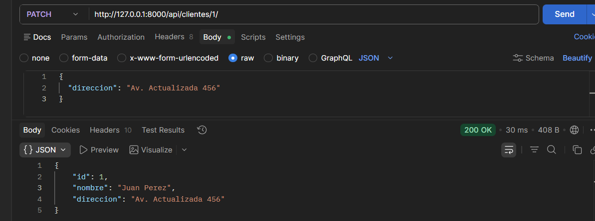
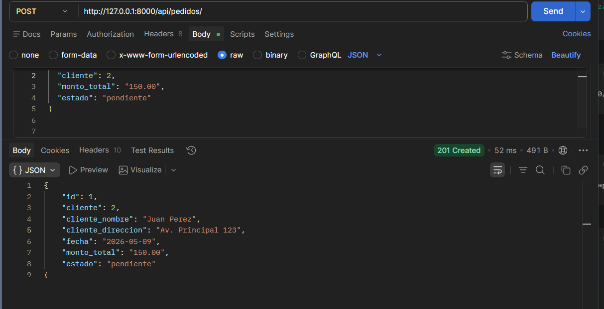
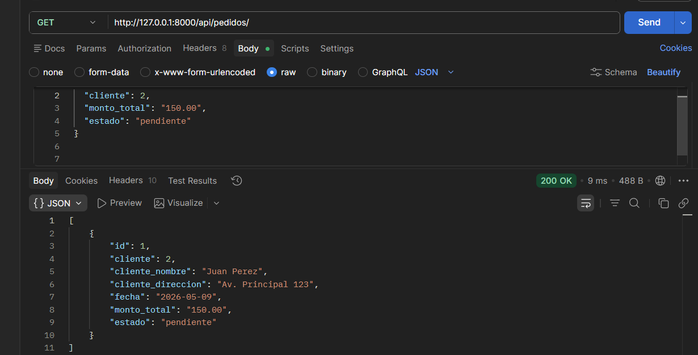
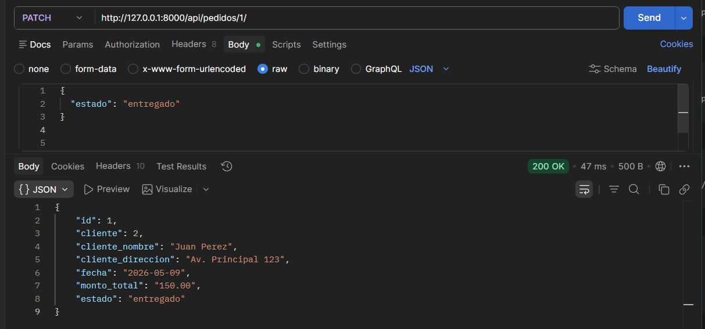

# Orderflow API

API REST desarrollada con Django y Django REST Framework para administrar clientes y pedidos.

El proyecto corresponde a un Gestor de Pedidos. Permite registrar clientes, crear pedidos asociados a un cliente, consultar pedidos, actualizarlos, eliminarlos y realizar busquedas por estado o por nombre del cliente.

La gestion se realiza mediante endpoints de Django REST Framework. No se usa Django Admin como interfaz de gestion.

## Tecnologias usadas

- Python
- Django 6.0.5
- Django REST Framework 3.17.1
- SQLite

## Instrucciones para ejecutar el servidor

Entrar a la carpeta del proyecto:

```powershell
cd C:\orderflow_api
```

Activar el entorno virtual:

```powershell
.\venv\Scripts\Activate.ps1
```

Instalar dependencias:

```powershell
pip install -r requirements.txt
```

Ejecutar migraciones:

```powershell
python manage.py makemigrations
python manage.py migrate
```

Iniciar el servidor:

```powershell
python manage.py runserver
```

URL base de la API:

```text
http://127.0.0.1:8000/api/
```

## Entidades del proyecto

### Cliente

| Campo | Descripcion |
| --- | --- |
| `id` | Identificador del cliente |
| `nombre` | Nombre del cliente |
| `direccion` | Direccion del cliente |

### Pedido

| Campo | Descripcion |
| --- | --- |
| `id` | Identificador del pedido |
| `cliente` | Cliente asociado al pedido |
| `fecha` | Fecha generada automaticamente |
| `monto_total` | Monto total del pedido |
| `estado` | Estado del pedido |

Estados disponibles:

```text
pendiente
en_proceso
entregado
cancelado
```

## Endpoints disponibles

### Clientes

| Metodo | Endpoint | Descripcion |
| --- | --- | --- |
| GET | `/api/clientes/` | Listar clientes |
| POST | `/api/clientes/` | Crear cliente |
| GET | `/api/clientes/{id}/` | Obtener cliente por ID |
| PUT | `/api/clientes/{id}/` | Actualizar cliente completo |
| PATCH | `/api/clientes/{id}/` | Actualizar cliente parcialmente |
| DELETE | `/api/clientes/{id}/` | Eliminar cliente |

### Pedidos

| Metodo | Endpoint | Descripcion |
| --- | --- | --- |
| GET | `/api/pedidos/` | Listar pedidos |
| POST | `/api/pedidos/` | Crear pedido |
| GET | `/api/pedidos/{id}/` | Obtener pedido por ID |
| PUT | `/api/pedidos/{id}/` | Actualizar pedido completo |
| PATCH | `/api/pedidos/{id}/` | Actualizar pedido parcialmente |
| DELETE | `/api/pedidos/{id}/` | Eliminar pedido |
| GET | `/api/pedidos/?search=pendiente` | Buscar pedidos por estado |
| GET | `/api/pedidos/?search=Juan` | Buscar pedidos por nombre del cliente |

## Ejemplos de uso

### Crear cliente

```bash
curl -X POST http://127.0.0.1:8000/api/clientes/ \
  -H "Content-Type: application/json" \
  -d "{\"nombre\":\"Juan Perez\",\"direccion\":\"Av. Principal 123\"}"
```

JSON usado en Postman:

```json
{
  "nombre": "Juan Perez",
  "direccion": "Av. Principal 123"
}
```

### Crear pedido

Antes de crear un pedido debe existir un cliente. El campo `cliente` recibe el `id` del cliente.

```bash
curl -X POST http://127.0.0.1:8000/api/pedidos/ \
  -H "Content-Type: application/json" \
  -d "{\"cliente\":1,\"monto_total\":\"150.00\",\"estado\":\"pendiente\"}"
```

JSON usado en Postman:

```json
{
  "cliente": 1,
  "monto_total": "150.00",
  "estado": "pendiente"
}
```

### Respuesta personalizada de pedido

La respuesta del pedido incluye datos del cliente asociado:

```json
{
  "id": 1,
  "cliente": 1,
  "cliente_nombre": "Juan Perez",
  "cliente_direccion": "Av. Principal 123",
  "fecha": "2026-05-09",
  "monto_total": "150.00",
  "estado": "pendiente"
}
```

## Cumplimiento de la actividad

| Requisito | Implementacion |
| --- | --- |
| Listado general de pedidos | `GET /api/pedidos/` |
| Creacion de pedidos | `POST /api/pedidos/` |
| Edicion de pedidos | `PUT/PATCH /api/pedidos/{id}/` |
| Eliminacion de pedidos | `DELETE /api/pedidos/{id}/` |
| Busqueda de pedidos | `GET /api/pedidos/?search=` |
| Relacion pedido-cliente | `Pedido` tiene `ForeignKey` hacia `Cliente` |
| CRUD de clientes | Endpoints `/api/clientes/` |
| Punto extra | `cliente_nombre` y `cliente_direccion` en pedidos |

## Evidencias en Postman

### CRUD de clientes

Crear cliente con `POST /api/clientes/`:



Listar clientes con `GET /api/clientes/`:



Actualizar cliente con `PATCH /api/clientes/{id}/`:



Eliminar cliente con `DELETE /api/clientes/{id}/`:


### CRUD de pedidos

Crear pedido con `POST /api/pedidos/`:



Listar pedidos con `GET /api/pedidos/`:



Actualizar pedido con `PATCH /api/pedidos/{id}/`:



Eliminar pedido con `DELETE /api/pedidos/{id}/`:


### Busqueda de pedidos

Buscar pedidos por estado con `GET /api/pedidos/?search=pendiente`:


Buscar pedidos por cliente con `GET /api/pedidos/?search=Juan`:


## Comandos utiles

Verificar el proyecto:

```powershell
python manage.py check
```

Ver migraciones aplicadas:

```powershell
python manage.py showmigrations
```
